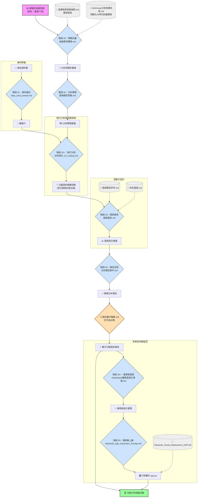

# 分析師武器庫使用手冊

這份文件說明如何把「分析師 Prompt 武器庫」從一堆獨立模板，串成一套連貫的分析工作流，
實現從**一次性分析**到**持續性監控**的閉環。

模板總索引見 [分析師武器庫.md](分析師武器庫.md)。

---

## 1. 關聯圖 (Workflow Diagram)

核心設計理念是 **「工作流 (Workflow)」**：前一階段的輸出，就是後一階段的輸入。



**圖例說明**
- **🟦 藍色實線節點**：一個流程階段，對應一份可直接取用的 Prompt 模板。
- **⬜ 灰色虛線節點**：輔助參考文件，不是流程階段，隨時查閱。
- **🟧 橘色節點**：品質關卡。跳過這關，報告裡的數字沒有人為它負責。
- **🟪 粉色 / 🟩 綠色**：流程的起點與終點。

**流程解讀**

1. 一切始於一個**模糊的商業問題**。
2. **【階段 00】** 把它轉成一份清晰的**分析問題定義書**。問題太大先用 `McKinsey分析架構流程.md` 拆議題樹。
3. 兵分兩路：**【階段 01】** 對原始資料產**數據卡**；**【階段 02】** 把定義書轉成**分析策略**。
4. **【階段 02+】** 結合數據卡與策略，讓 AI coding agent 實際跑數字，產出**已驗證的關鍵洞察**。
5. **【階段 03】** 把洞察轉成**圖表設計建議**（搭配圖表速查表與色板）。
6. **【階段 04】** 生成**靜態分析報告骨架**，然後跑 **`報告數字驗算.md`** 把每個數字驗一遍。
7. **【階段 04+ / 05】** 把驗過的洞察轉成**儀表板藍圖**，再生成**可部署的 Streamlit 應用**。
8. 最終導向**可執行的商業決策**。

---

## 2. 應用場景 (Use Cases)

| Use Case | 業務目標 | 如何應用武器庫 |
| :--- | :--- | :--- |
| **用戶流失分析** | 降低高價值用戶流失率，提升 LTV。 | 從「感覺流失變高了」的模糊問題，一路走到「針對高風險用戶推出個人化挽留活動」的具體建議。 |
| **行銷活動歸因** | 評估「雙12」活動成效，優化下次預算分配。 | 定義「成效」的具體指標，選擇歸因模型，用圖表呈現 ROI，產出預算調整報告。 |
| **產品銷售優化** | 找出「叫好不叫座」的產品，調整定價或庫存。 | 使用 ABC 分析或波士頓矩陣將產品分層，在報告中提出產品組合優化建議。 |
| **新功能採用率分析** | 新功能上線後的使用情況與滲透率提升。 | 定義「採用率」指標，比較使用/未使用者的用戶畫像差異，建議產品優化方向。 |

---

## 3. 完整走查：以「沈睡的鯨魚」為例

情境取自 [`00問題定義研究/商業場景模擬案例.md`](00問題定義研究/商業場景模擬案例.md) 案例一。
你是電商平台的 CRM 經理，想找出「曾經買很多、但最近消失的 VIP」。
使用資料集：`資料集/Online Retail/online_retail_09_10.csv`（525,461 筆交易）。

---

### 步驟 1：定義問題（階段 00）

- **你的行動**：打開 [`00問題定義研究/抽象需求轉換.md`](00問題定義研究/抽象需求轉換.md)，
  把案例一的 `CONTEXT` 區塊（角色 = CRM 經理、需求 = 「不知道誰是金雞母…想用 RFM 分群」）填進去。
- **AI 的輸出**：一份**分析問題定義書**，把「金雞母」這種模糊說法轉成可量化的定義。例如：
  - **核心問題**：哪些高價值客戶已進入沈睡狀態，其規模與營收貢獻為何？
  - **關鍵指標**：Recency / Frequency / Monetary 三分位，沈睡 VIP 人數、營收占比
  - **初步假設**：R > 90 天且歷史 F 值居前 20% 的客戶，是最值得召回的一群
  - **所需數據**：`CustomerID`, `InvoiceNo`, `InvoiceDate`, `Quantity`, `UnitPrice`

> ⚠️ 這一步的產出是後面**所有**階段的輸入，值得多花點時間跟 AI 來回修。

---

### 步驟 2：認識資料（階段 01）

- **你的行動**：打開 [`01資料描述/data_card_prompt.md`](01資料描述/data_card_prompt.md)。
  - **模式 A（聊天視窗）**：先在本機跑 `df.info()` / `df.describe()`，把輸出貼進 `CONTEXT`。
  - **模式 B（AI Coding）**：直接告訴 agent 資料集路徑，它會自己讀檔算真實統計。
- **AI 的輸出**：一份**數據卡**，你會在這裡第一次看到資料的真面目，例如：
  - `CustomerID` 有 **20.54% 缺失** — 這些交易做不了 RFM，必須先決定怎麼處理
  - 有 **10,206 筆 `InvoiceNo` 以 `C` 開頭**的退貨單，`Quantity` 為負值
  - 有 **3,690 筆 `UnitPrice <= 0`** 的異常記錄

> 💡 這一步常常會直接推翻步驟 1 的假設。發現資料撐不起原本的問題定義時，**回頭改定義書**，不要硬做。

---

### 步驟 3：選擇策略（階段 02）

- **你的行動**：打開 [`02數據分析/商用模型思維.md`](02數據分析/商用模型思維.md)，貼上步驟 1 的完整定義書。
- **AI 的輸出**：一份**分析策略建議**，說明為什麼選 RFM、具體要算哪些欄位、分幾群、
  以及預期能挖出什麼洞察。它也會提供備選方案（例如邏輯迴歸流失預測）供你比較。

---

### 步驟 4：執行分析（階段 02+）★ 這步以前是空白的

- **你的行動**：打開 [`02數據分析/分析執行_AI_Coding.md`](02數據分析/分析執行_AI_Coding.md)，
  把步驟 2 的數據卡與步驟 3 的策略建議一起交給 AI coding agent。
- **AI 的行動**：agent 會**實際寫出並執行** Python 程式碼 — 讀檔、依數據卡的發現做清洗
  （剔除 `C` 開頭退貨、剔除 `CustomerID` 缺失、剔除非正價量）、計算 RFM、分群、輸出統計結果。
- **AI 的輸出**：**帶著真實數字的關鍵洞察**，以及一份可重跑的分析腳本。例如：
  - 「沈睡 VIP」共 N 人，占總客戶數 X%，歷史貢獻營收 Y%
  - 這群人的平均 Recency 為 Z 天，遠高於活躍客戶

> ⚠️ **模式 A 的使用者請注意**：聊天視窗算不了 52 萬筆資料。
> 若你在聊天視窗，這一步必須由你自己在 Jupyter / Excel 裡完成，再把結果數字帶到步驟 5。
> **絕對不要讓聊天視窗「估一個數字」給你** — 它會編，而且編得很像真的。

---

### 步驟 5：設計圖表（階段 03）

- **你的行動**：打開 [`03圖表選用/圖表選型.md`](03圖表選用/圖表選型.md)，
  描述你在步驟 4 得到的洞察、資料結構、以及溝通對象（例如：行銷副總）。
  拿不定主意時，翻 [`圖表類型參考.md`](03圖表選用/圖表類型參考.md) 的四大目的速查表。
- **AI 的輸出**：**圖表設計建議** — 主推圖表類型、能直接點出結論的標題、座標軸配置、
  排序與配色要點，以及一個替代方案。
- **選配**：需要整份報告配色統一時，再跑一次 [`色系風格.md`](03圖表選用/色系風格.md) 產出 HEX 色板。

---

### 步驟 6：生成報告並驗算（階段 04）

- **你的行動**：打開 [`04報告呈現/分析報告製作.md`](04報告呈現/分析報告製作.md)，把所有核心洞察填入 `CONTEXT`。
- **AI 的輸出**：一份以「結論先行」原則寫好的**靜態分析報告骨架**，含執行摘要、關鍵發現與商業建議。
- **⚠️ 必做的下一動作**：跑 [`04報告呈現/報告數字驗算.md`](04報告呈現/報告數字驗算.md)。
  報告模板裡的範例數字（「降低 15%」「高 40%」）**全部是佔位符**，
  AI 在填空時很容易順手保留或改寫成另一個同樣沒有根據的數字。這一關會把每個數字重新從原始資料算一遍。

---

### 步驟 7：設計監控儀表板（階段 04+）

- **你的行動**：你意識到客戶沈睡是需要**持續監控**的問題，不該每季手動重跑一次。
  打開 [`04報告呈現/Dashboard儀表板設計規劃.md`](04報告呈現/Dashboard儀表板設計規劃.md)，填寫 `CONTEXT`：
  ```
  - 儀表板核心目標: 幫助 CRM 團隊即時監控高價值客戶的沈睡風險，並快速圈出可召回名單。
  - 主要用戶: CRM 經理、行銷企劃。
  - 分析報告骨架: [貼上步驟 6 驗算過的完整報告骨架]
  ```
- **AI 的輸出**：一份**儀表板設計藍圖** — 定義儀表板類型（操作型）、核心指標、F 型佈局，
  並把報告中的每個「關鍵發現」轉成具體的圖表組件與連動篩選關係。

---

### 步驟 8：儀表板上線（階段 05）

- **你的行動**：打開 [`05儀表板上線_streamlit/Streamlit_App_Generator_Prompt.md`](05儀表板上線_streamlit/Streamlit_App_Generator_Prompt.md)，
  貼上步驟 7 的藍圖與資料集路徑。
- **AI 的輸出**：完整的 `app.py` 與 `requirements.txt`。
- **接著**：照 [`Streamlit_Cloud_Deployment_SOP.md`](05儀表板上線_streamlit/Streamlit_Cloud_Deployment_SOP.md)
  做本地測試與雲端部署。

---

**最終成果**

走完這八步，你不只完成了一次深入的專項分析、產出一份**數字經過驗證的靜態報告**，
還把它昇華成一個**長期可用的動態監控儀表板**，把一次性洞察轉成持續的業務價值。
