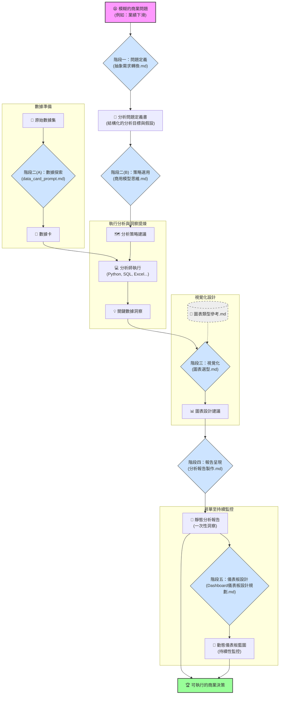

# 分析師武器庫使用手冊

這份文件旨在說明如何活用「分析師 Prompt 武器庫」，將其從一系列獨立的模板，轉化為一套連貫、高效的分析工作流，實現從**一次性分析**到**持續性監控**的閉環。

## 1. 關聯圖 (Workflow Diagram)

這套 Prompt 武器庫的核心設計理念是 **「工作流 (Workflow)」**，前一個階段的輸出，就是後一個階段的輸入，形成一個環環相扣的分析鏈。



**圖例說明**:
- **🟦 藍色節點**: 表示這是一個可直接取用的 Prompt 模板 (`.md` 檔案)。
- **🟪 粉色節點**: 表示分析流程的起點。
- **🟩 綠色節點**: 表示分析流程的終點，產出商業價值。

**流程解讀**:

1.  一切始於一個**模糊的商業問題**。
2.  使用**【階段一】**的 Prompt 將其轉化為一份清晰的**分析問題定義書**。
3.  接著兵分兩路：對**原始數據**進行探索獲得**數據卡**；將**定義書**轉化為**分析策略**。
4.  結合數據與策略，你（分析師）動手分析，提煉出**關鍵洞察**。
5.  將洞察交給**【階段三】**的 Prompt，並參考`圖表類型參考.md`，獲得專業的**圖表設計建議**。
6.  將所有成果交給**【階段四】**的 Prompt，生成一份結構完整的**靜態分析報告**。
7.  **昇華**: 將**靜態報告**中的洞察，交給**【階段五】**的 Prompt，設計出用於持續監控的**動態儀表板藍圖**。
8.  最終，無論是靜態報告還是動態儀表板，都能導向**可執行的商業決策**。

## 2. 應用場景 (Use Cases)

這套武器庫適用於幾乎所有數據驅動的決策場景。以下是幾個典型的 Use Case：

| Use Case | 業務目標 | 如何應用武器庫 |
| :--- | :--- | :--- |
| **用戶流失分析** | 降低高價值用戶的流失率，提升用戶終身價值 (LTV)。 | 透過工作流，從「感覺流失變高了」的模糊問題，一步步走到「針對高風險用戶推出個人化挽留活動」的具體建議。 |
| **行銷活動歸因** | 評估上次的「雙12」行銷活動成效如何，並優化下一次的預算分配。 | 透過工作流，定義「成效」的具體指標，選擇合適的歸因模型，並用清晰的圖表呈現 ROI，最終產出預算調整報告。 |
| **產品銷售優化** | 找出哪些產品是「叫好不叫座」（利潤低但銷量高），並調整定價或庫存策略。 | 透過工作流，定義分析目標，使用 ABC 分析或波士頓矩陣等框架，將產品分層，並在報告中提出具體的產品組合優化建議。 |
| **新功能採用率分析** | APP 上線了一個新功能，想知道用戶使用情況如何，以及如何提升其滲透率。 | 透過工作流，定義「採用率」指標，分析使用與未使用該功能的用戶畫像差異，並在報告中建議產品優化的方向（如改善UI/UX）。 |

## 3. 策略模擬：以「用戶流失分析」為例

假設你是一位電商平台的營運經理，你發現最近用戶流失好像變嚴重了，你打算使用這套武器庫來分析並解決問題。

---

#### **步驟 1 ~ 4 (同前)**
(此處省略前四個步驟的詳細說明，與上一版本相同)

---

#### **步驟 5：生成報告**

-   **你的行動**: 你已經有了所有材料，準備做最後的報告。你打開 `04報告呈現\分析報告製作.md`，將你的所有核心洞察填入 `CONTEXT`。
-   **AI 的輸出**: 一份以「結論先行」原則寫好的**靜態分析報告骨架**，包含執行摘要、關鍵發現和具體的商業建議。這份報告非常適合用於當次的決策會議。

---

#### **步驟 6：設計監控儀表板 (從一次性到持續性)**

-   **你的行動**: 你意識到，用戶流失是一個需要持續監控的問題。你決定將剛剛的分析報告成果，轉化為一個動態儀表板。你打開 `04報告呈現\Dashboard儀表板設計規劃.md`，填寫 `CONTEXT`。
-   **你的輸入 (CONTEXT)**:
    ```
    - 儀表板核心目標: 幫助營運團隊即時監控高價值用戶的流失風險，並快速定位問題。
    - 主要用戶: 營運經理、客服主管。
    - 分析報告骨架: [貼上步驟5產出的完整報告骨架]
    ```
-   **AI 的輸出**: 一份完整的「**儀表板設計藍圖**」。藍圖中會明確定義儀表板的類型（操作型）、核心指標（週流失率）、整體佈局（F型佈局），並將報告中的「關鍵發現」（如：高頻投訴是預警信號）轉化為儀表板上的具體圖表組件（如：流失預警信號趨勢圖、高風險用戶列表），甚至定義了圖表之間的連動篩選關係。

---

**最終成果**:
通過這六個步驟，您不僅完成了一次深入的專項分析，產出了一份高質量的**靜態分析報告**，還基於此設計出了一份可供長期使用的**動態監控儀表板藍圖**，完美地將一次性洞察轉化為持續的業務價值。
