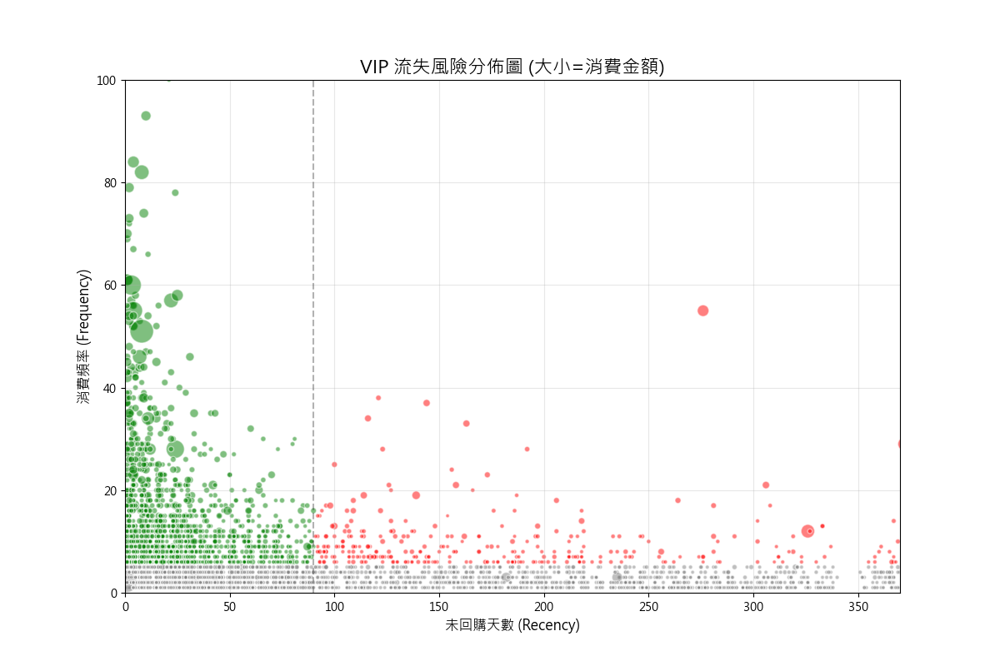
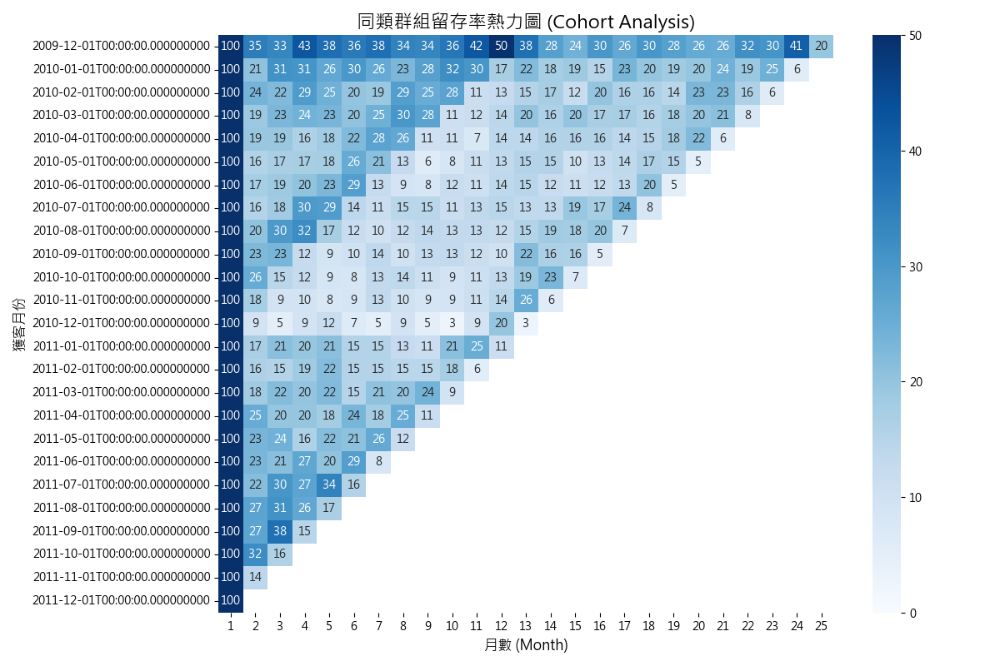

# 數據分析報告：Online Retail 高價值客戶挽留與留存策略

**標題**: **挽留百萬英鎊營收：針對 VIP 客戶流失與新客留存的行動方案**

---

#### **1. 執行摘要 (Executive Summary)**
本報告旨在解決 Online Retail 平台面臨的高價值客戶潛在流失與新客留存率偏低的問題。數據分析顯示，目前有 **227 位 VIP 客戶** 處於高流失風險狀態，涉及潛在營收高達 **£1,018,867**。同時，新客首月留存率平均僅 **21.2%**，顯示早期體驗存在斷層。我們建議立即啟動「VIP 喚回計畫」與「新客首月引導優化」，預計可挽回 15% 的高風險營收並顯著提升客戶終身價值。

---

#### **2. 關鍵發現 (Key Findings)**

*   **發現一：百萬英鎊的危機 —— 高價值 VIP 正在悄悄離開**
    *   *支撐圖表：《VIP 流失風險分佈圖 (RFM Bubble Chart)》*
    *   下圖展示了所有客戶在 Recency (X軸) 與 Frequency (Y軸) 的分佈。紅色區域代表「高頻消費但近期未回購」的風險群體。
    *   **洞察**: 共有 **227 位** 客戶落入高風險區（紅色），他們過去貢獻巨大（氣泡大），但已超過 90 天未回購。這群人是我們最優先需要挽救的資產。

*   **發現二：新客留存的「次月斷崖」**
    *   *支撐圖表：《同類群組留存熱力圖 (Cohort Retention Heatmap)》*
    *   下圖追蹤了不同月份加入的新客戶在後續月份的留存情況。
    *   **洞察**: 不論哪個月加入，客戶在第二個月的留存率（Month 1 欄位）平均驟降至 **21.2%**。這意味著近 80% 的新客戶在首購後就流失了，顯示「首購後體驗」優化空間巨大。

*   **發現三：營收高度集中，VIP 對生意至關重要**
    *   *支撐數據*: 前 **22.1%** 的 Gold 客戶貢獻了 **72.2%** 的總營收。
    *   **洞察**: 失去一位 VIP 的損失，相當於失去 20 位普通客戶。資源應不對稱地投入在 Gold 客戶的維護上。

---

#### **3. 詳細分析 (Detailed Analysis)**

**3.1 流失風險量化分析**
透過 RFM 模型，我們將客戶依價值分群。雖然「Gold VIP」群體貢獻了絕大多數營收，但其中有相當比例已進入沈睡狀態。
- **高風險 VIP 特徵**: 平均消費頻率 > 5 次，但最近一次消費距今已超過 100 天。
- **潛在損失**: 若這 227 人完全流失，我們將損失年化營收約 £1M，這尚未包含重新獲客的成本。

**3.2 留存率趨勢與季節性**
同類群組分析顯示，留存率隨時間呈現穩定的指數型衰退：
- **初期 (Month 1-3)**: 流失最快，平均留存率從 100% 跌至 20% 左右。
- **穩定期 (Month 6+)**: 留存率維持在 15-18% 區間。
- **異常點**: 透過熱力圖可見，某些特定月份（如年底大促期間）獲取的新客，其長期留存率略低於平均，可能源於「促銷型用戶」佔比較高。

---

#### **4. 商業建議 (Business Recommendations)**

**建議一：啟動「Project Rescue」主動挽回高風險 VIP**
- **具體措施**: 
    1. 匯出 227 位高風險 VIP 名單。
    2. 發送專屬「回歸禮包」（如：無門檻高額抵用券 + 新品優先購買權），文案強調「我們想念您」而非單純促銷。
    3. 對於其中的 Top 50 超級大戶，由客服經理進行一對一電話關懷。
- **預期效益**: 目標挽回 20% 的流失邊緣客戶，預計守住 **£200,000** 年營收。

**建議二：實施「黃金 30 天」新客引導旅程**
- **具體措施**: 
    1. 在首購後的第 3、7、14 天設計自動化觸達流程（EDM/App推播）。
    2. 第 3 天：確認收貨滿意度與使用教學。
    3. 第 7 天：推薦與首購商品具高度關聯性的互補品（Cross-sell）。
    4. 第 14 天：提供「二購專屬優惠」，以此突破次月留存斷崖。
- **預期效益**: 將次月留存率由 21% 提升至 **25%**。

**建議三：建立 VIP 分級權益體系**
- **具體措施**: 針對貢獻 72% 營收的 Gold 客戶，將其權益制度化（如：專屬客服通道、生日好禮、退貨免運），增加其轉移成本與心理黏著度。

---

#### **5. 附錄 (Appendix)**
*   **數據來源**: `online_retail_merged.csv` (涵蓋 2009-12-01 至 2011-12-09 交易數據)
*   **分析樣本**: 5,878 位不重複客戶，僅計算有效交易 (Quantity > 0)。
*   **分析方法**: 
    *   **RFM**: 基於 Recency, Frequency, Monetary 將客戶五等分並組合評分。
    *   **Cohort**: 依「首購月份」將客戶分組，追蹤後續月份的活躍佔比。
